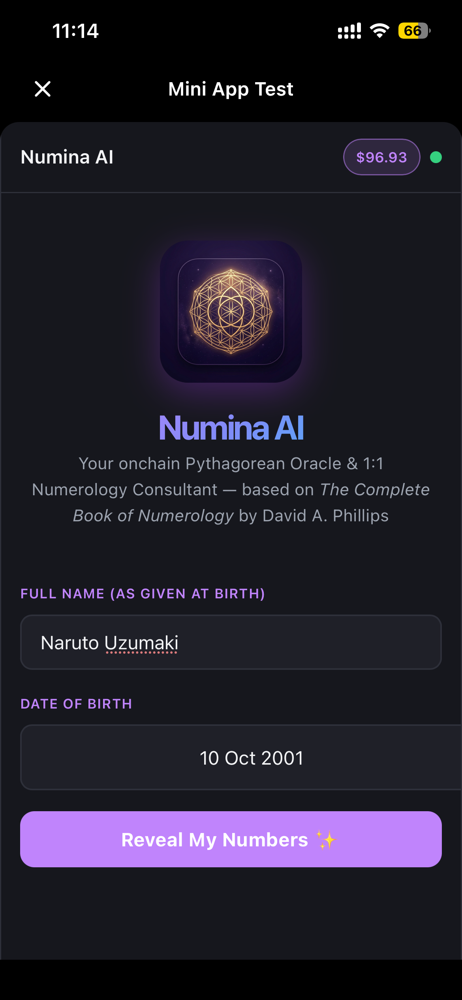
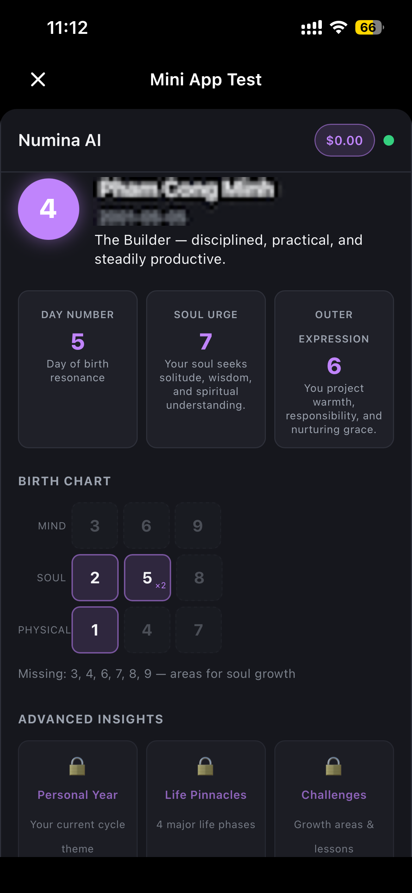
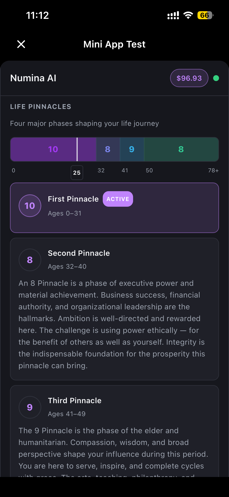
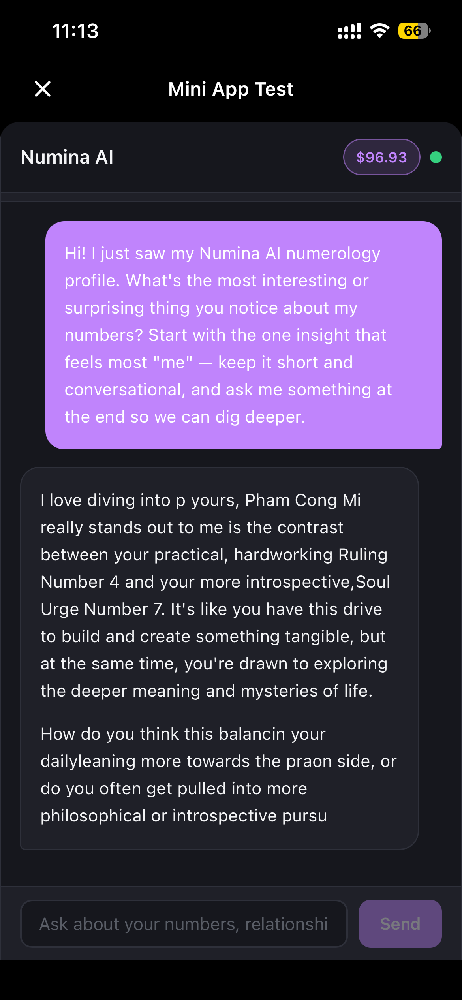

# Numina AI — MiniPay Mini App

<p align="center">
  
</p>

<p align="center">
  An AI-powered Pythagorean numerology oracle and 1:1 AI consultant built natively for <a href="https://minipay.to/">MiniPay</a> on Celo.<br/>
  Enter your name and birthday to receive an instant profile, then unlock deep interpretations<br/>
  and an ongoing AI conversation — all paid in USDC on-chain.
</p>

<p align="center">
  Built for <strong>Celo Proof of Ship</strong> — May 2025
</p>

<p align="center">
  
</p>

---

## Screenshots

| Entry | Profile | Advanced Insights | AI Chat |
|:---:|:---:|:---:|:---:|
|  |  |  |  |
| Name & birthday form | Free instant numerology profile | Paid deep reading ($0.50 USDC) | Live AI consultant chat |

> Add your MiniPay screenshots to `docs/screenshots/` matching the filenames above.

---

## Live Deployment

| Service | URL |
|---|---|
| **App (frontend)** | https://numina-ai.pcminh0505.workers.dev |
| **API (backend)** | https://numina-ai-api.fly.dev |
| **LLM proxy** | https://numina-ai-llm.pcminh0505.workers.dev |

**Stack:** Cloudflare Workers (frontend + LLM proxy) · Fly.io Singapore (Express API) · Cloudflare Workers AI `@cf/meta/llama-3.3-70b-instruct-fp8-fast`

---

## What It Does

### Free — Instant Profile (no AI, no cost)

Enter your name and birthday. Your profile computes instantly in the browser:

- **Ruling Number** (Life Path) — your core life purpose
- **Day Number** — the energy you were born with
- **Soul Urge** — what drives you at the deepest level
- **Outer Expression** — how the world sees you
- **Birth Chart Grid** — a 3×3 visualization of which numbers appear in your birth date, and which are missing

### Paid — Advanced Reading ($0.50 USDC)

Unlock a deeper layer powered by David A. Phillips' *The Complete Book of Numerology*:

- **Personal Year** — your current 9-year cycle theme
- **Life Pinnacles** — a visual timeline showing 4 major life phases with age ranges and interpretations
- **Core Challenges** — the growth lessons encoded in your birth date

Payment goes directly on-chain via the `NumerologyReading` smart contract deployed on Celo.

### AI Chat Consultant

Chat with Numina, an AI numerology consultant that knows your full profile. The AI responds like a warm, sharp personal coach — short and conversational, not an academic lecture.

- **5 free messages per day** per wallet
- **Buy 20 more for $0.20 USDC** — on-chain purchase, credits persist
- **Referral system** — share your link, both wallets get +5 messages

### Session Memory

Your profile and entire chat history are saved to `localStorage` keyed by wallet address. Close the app, come back later — your reading is still there.

---

## On-Chain Architecture

### NumerologyReading.sol

The core smart contract deployed on Celo. It is the single source of truth for payment state.

```solidity
mapping(address => bool)    public hasAdvanced;       // advanced unlock — permanent
mapping(address => uint256) public creditsPurchased;  // cumulative chat credits purchased

function unlockAdvanced() external  // $0.50 USDC → sets hasAdvanced[msg.sender]
function buyCredits(uint256 packs)  // $0.20 × packs USDC → adds 20 credits per pack
```

The server reads `hasAdvanced` and `creditsPurchased` directly from the chain via viem on every `/api/credits` request — no trust required in the server's in-memory state.

### Payment Flow

1. Client checks USDC allowance for the contract
2. If insufficient: sends `approve(contract, amount)` — one tx
3. Calls `unlockAdvanced()` or `buyCredits(1)` — one tx
4. Contract pulls USDC from wallet to treasury, records state on-chain
5. UI refetches from chain — unlocks immediately

All gas fees paid in USDC via Celo's CIP-64 fee abstraction.

---

## Infrastructure

```
Browser
  └─► Cloudflare Workers (numina-ai) — static Vite build + /api/* proxy
        └─► Fly.io Express (numina-ai-api, Singapore) — credit gating, on-chain reads
              └─► Cloudflare Workers AI (numina-ai-llm) — Llama 3.3 70B FP8
```

### Components

| Component | Platform | Config |
|---|---|---|
| Frontend (React/Vite) | Cloudflare Workers | `wrangler.toml` + `worker/proxy.js` |
| API server (Express) | Fly.io SIN | `fly.toml` + `Dockerfile` |
| LLM proxy | Cloudflare Workers | `wrangler.ai-proxy.toml` + `worker/ai-proxy.js` |

The LLM proxy translates Cloudflare Workers AI's SSE format into OpenAI-compatible SSE so the backend's existing streaming code works unchanged. The proxy is protected by a shared secret (`AI_SECRET` wrangler secret).

### Redeploy

```bash
# Frontend (after code change)
pnpm build && npx wrangler deploy

# Backend
fly deploy --app numina-ai-api

# LLM proxy (rarely needed)
npx wrangler deploy --config wrangler.ai-proxy.toml
```

---

## LLM Backends

The server supports three interchangeable backends (configured via env / Fly.io secrets):

| Priority | Backend | Config |
|---|---|---|
| 1 | Cloudflare Workers AI (production) | `LLM_BASE_URL=https://numina-ai-llm.pcminh0505.workers.dev/v1` |
| 2 | Local (mlx-lm, Ollama) | `LLM_BASE_URL=http://localhost:8080/v1` |
| 3 | OpenRouter | `OPENROUTER_API_KEY=...` |
| 4 | Anthropic API | `ANTHROPIC_API_KEY=...` |

---

## Proof of Ship Checklist

| Requirement | Status |
|---|---|
| MiniPay integration (`useAutoConnect`, `isMiniPayEnvironment`, fee abstraction) | Done |
| Smart contract deployed on Celo mainnet | `NumerologyReading.sol` at `0x06a0De14485e6b9F4045821C54b719ECeCc35613` |
| On-chain USDC transactions | Every advanced unlock + credit purchase |
| ERC-8004 agent registration | `pnpm register:agent` → tx on Celo Sepolia/mainnet |
| Self.xyz Agent ID | `SELF_AGENT_ID` in `.env` → exposed at `GET /api/health` |

---

## Running Locally

### Prerequisites

- [pnpm](https://pnpm.io/) — package manager
- [Foundry](https://getfoundry.sh/) — for Solidity tests and contract deploy (`curl -L https://foundry.paradigm.xyz | bash && foundryup`)
- A MiniPay wallet or injected wallet for testing

### Setup

```bash
git clone https://github.com/pcminh0505/minipay-miniapp-quickstart
cd minipay-miniapp-quickstart

pnpm install
cp .env.example .env
# Fill in your API key and treasury address in .env
```

### Configure an LLM

Pick one in `.env`:

```bash
# Option A — Anthropic
ANTHROPIC_API_KEY=sk-ant-...

# Option B — OpenRouter
OPENROUTER_API_KEY=sk-or-...

# Option C — Local (Apple Silicon)
# mlx_lm.server --model mlx-community/Qwen3.6-35B-A3B-4bit --port 8080
LLM_BASE_URL=http://localhost:8080/v1
LLM_MODEL=mlx-community/Qwen3.6-35B-A3B-4bit
LLM_API_KEY=local
LLM_ENABLE_THINKING=false
```

### Run

```bash
pnpm dev           # Frontend — http://localhost:5173
pnpm dev:server    # API server — http://localhost:3001 (required for chat)
```

### Deploy the contract (testnet first)

```bash
pnpm deploy:contract
# Prints the deployed address — paste it into .env as:
# VITE_READING_CONTRACT_TESTNET=0x...
# READING_CONTRACT_TESTNET=0x...
```

Then deploy to mainnet:

```bash
DEPLOY_CHAIN=mainnet pnpm deploy:contract
```

### Run Solidity tests

```bash
forge test -v
# 14 tests, no network required
```

### Test in MiniPay

```bash
ngrok http 5173  # get a public HTTPS URL
```

In MiniPay: **Settings → About** → tap version 7× → **Developer Settings** → enable Developer Mode + Use Testnet → **Load test page** → paste the ngrok URL.

---

## Project Structure

```
src/
  components/
    NumerologyChat.tsx      # Phase state machine: entry → profile → chat
    NumerologyProfile.tsx   # Free instant profile card
    NumerologyAdvanced.tsx  # Paid reading + Pinnacle timeline graph
  hooks/
    useAdvancedUnlock.ts    # approve USDC → call contract
    useBuyCredits.ts        # approve USDC → call contract
    useCredits.ts           # fetch credits (merges on-chain + server state)
    useReferral.ts          # referral registration on wallet connect
  lib/
    numerology.ts           # Pythagorean calculations
    readingContract.ts      # NumerologyReading ABI + address lookup
    x402.ts                 # Payment config helpers
  data/
    numerologyBook.json     # ~221KB book passages injected into AI system prompt
    advancedNumerology.json # Personal Year, Pinnacles, Challenges interpretations

contracts/
  NumerologyReading.sol     # Payment gateway — hasAdvanced + creditsPurchased

server/
  index.ts                  # Express API: chat, credits, health
  bookExtractor.ts          # System prompt builder
  credits.ts                # Credit store (free daily + on-chain tracking)

worker/
  proxy.js                  # CF Worker: serves static site + proxies /api/* to Fly.io
  ai-proxy.js               # CF Worker: OpenAI-compatible endpoint over Workers AI

scripts/
  deployNumerologyReading.ts  # Deploy contract + print env vars
  registerERC8004.ts          # ERC-8004 on-chain agent registration
```

---

## Tech Stack

- [Vite 8](https://vite.dev) + [React 19](https://react.dev) + TypeScript
- [wagmi v3](https://wagmi.sh) + [viem](https://viem.sh)
- [@tanstack/react-query v5](https://tanstack.com/query)
- [Foundry](https://getfoundry.sh/) — Solidity testing + deployment
- [Cloudflare Workers](https://workers.cloudflare.com/) — frontend + LLM proxy
- [Fly.io](https://fly.io/) — Express API (Singapore)
- Celo mainnet + Celo Sepolia

## Contract Addresses

| Contract | Network | Address |
|---|---|---|
| NumerologyReading | Celo Sepolia | `0x8fD193Aa77835D54E83B1Ddcc0FbAa4042295e0C` |
| NumerologyReading | Celo mainnet | `0x06a0De14485e6b9F4045821C54b719ECeCc35613` |
| USDC | Celo mainnet | `0xcebA9300f2b948710d2653dD7B07f33A8B32118C` |
| USDC | Celo Sepolia | `0x01C5C0122039549Ad1493B8220cABEdD739BC44E` |
| ERC-8004 Registry | Celo mainnet | `0x8004A169FB4a3325136EB29fA0ceB6D2e539a432` |
| ERC-8004 Registry | Celo Sepolia | `0x8004A818BFB912233c491871b3d84c89A494BD9e` |

## References

- [MiniPay developer docs](https://docs.minipay.xyz)
- [Celo fee abstraction — CIP-64](https://docs.celo.org/tooling/overview/fee-abstraction)
- [ERC-8004 Agent Trust Protocol](https://eips.ethereum.org/EIPS/eip-8004)
- [Celo token contracts](https://docs.celo.org/tooling/contracts/token-contracts)
- *The Complete Book of Numerology* by David A. Phillips (Hay House)
