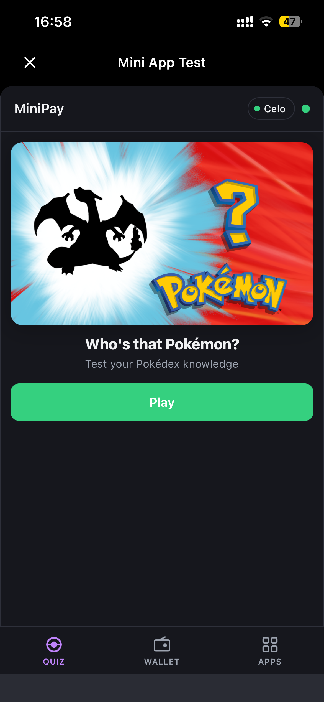
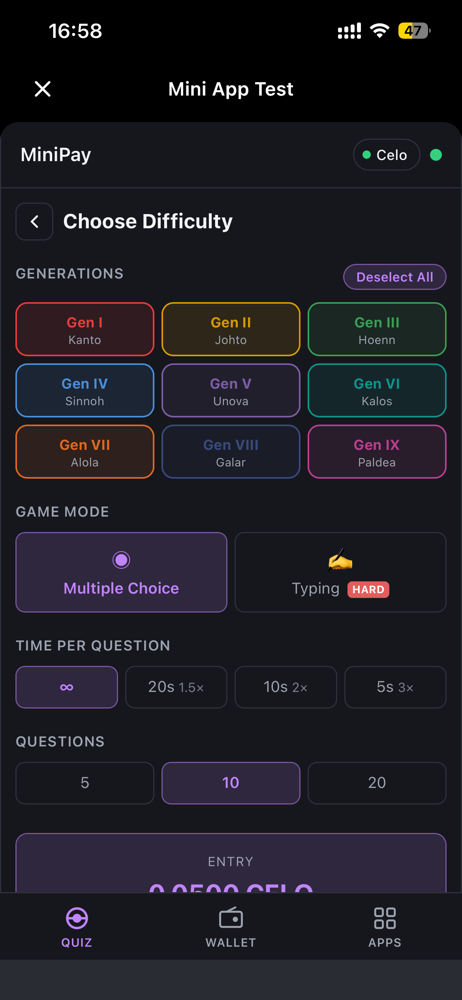
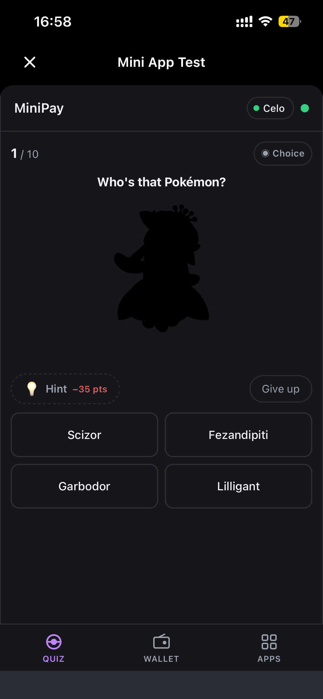
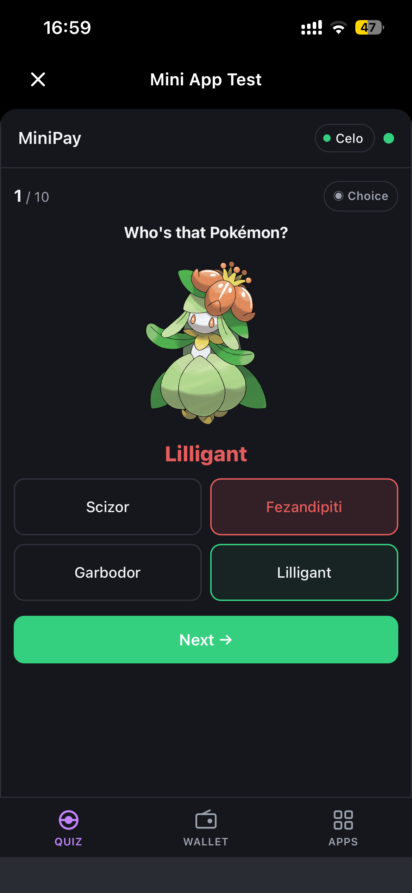
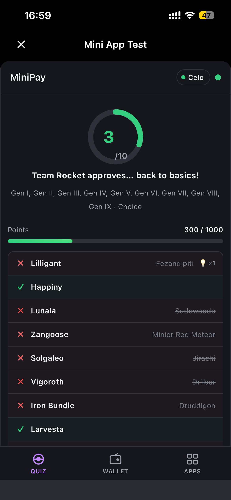

# Who's That Pokémon? — MiniPay Mini App

A skill-based quiz game built as a MiniPay mini app on Celo. Players identify Pokémon from their silhouette — configure the difficulty, race against the clock, and earn CELO proportional to your score.


<table>
  <tr>
    <th>Screen</th>
    <th>Preview</th>
  </tr>
  <tr>
    <td><strong>Cover</strong></td>
    <td></td>
  </tr>
  <tr>
    <td><strong>Difficulty Setup</strong></td>
    <td></td>
  </tr>
  <tr>
    <td><strong>Gameplay</strong></td>
    <td></td>
  </tr>
  <tr>
    <td><strong>Answer Reveal</strong></td>
    <td></td>
  </tr>
  <tr>
    <td><strong>Results</strong></td>
    <td></td>
  </tr>
</table>

---

## How it works

1. **Cover** — The classic TV show banner animates a rotating Pokémon silhouette over the iconic starburst. Tap **Play** to begin.
2. **Setup** — Pick your difficulty across three axes:
   - **Generations** — Gen I through Gen IX, single or multi-select
   - **Game mode** — Multiple Choice or Typing (harder, freeform input)
   - **Time per question** — Unlimited / 20s (1.5×) / 10s (2×) / 5s (3×)
   - **Questions** — 5 / 10 / 20
     The combination determines your **entry price** and **max prize** in CELO, shown live.
3. **Gameplay** — A black silhouette (`filter: brightness(0)`) fills the screen. Guess from four choices or type the name. One mystery hint per question (💡 −35 pts) and a Give Up button if you're stuck.
4. **Answer reveal** — The silhouette fades to full color with the Pokémon's name. Correct = green flash; wrong = red shake.
5. **Results** — Animated score ring, per-question breakdown with wrong answers shown, and a prize box displaying how much CELO you earned.

---

## Prize calculation

| Factor             | Effect                                                      |
| ------------------ | ----------------------------------------------------------- |
| Time pressure      | Unlimited 1×, 20s 1.5×, 10s 2×, 5s 3×                       |
| Generation breadth | 1 gen 1×, 2–3 gens 1.5×, 4–6 gens 2×, 7–9 gens 2.5×         |
| Game mode          | Multiple Choice 1×, Typing 1.5×                             |
| Questions          | 5Q = 0.01 CELO base, 10Q = 0.02, 20Q = 0.05                 |
| Hint penalty       | −35 pts per hint used                                       |
| Time bonus         | Up to +50 pts per question (proportional to time remaining) |

`entry = base × time_mult × era_mult × mode_mult`  
`max_prize = entry × 5`  
`earned_prize = (earned_points / max_points) × max_prize`

> Prizes are display-only — no on-chain transaction yet. Web3 integration is the next phase.

---

## Hint system

One hint is pre-assigned per question, type hidden until tapped. The eligible pool depends on your config:

| Hint type      | Available when                                  |
| -------------- | ----------------------------------------------- |
| **Type**       | Always                                          |
| **1st Letter** | Typing mode only (too easy for multiple choice) |
| **Region**     | 2+ generations selected                         |

---

## Getting started

```bash
pnpm install
cp .env.example .env
pnpm dev          # http://localhost:5173
```

### Test in MiniPay via ngrok

```bash
pnpm dev          # start dev server on port 5173
ngrok http 5173   # get a public https URL
```

In MiniPay on your phone:

1. **Settings → About** — tap the version number repeatedly to unlock developer mode
2. **Settings → Developer Settings** — enable **Developer Mode** + **Use Testnet** (Celo Sepolia)
3. Tap **Load test page** → paste your ngrok URL

---

## Stack

- [Vite 8](https://vite.dev) + [React 19](https://react.dev) + TypeScript (React Compiler enabled)
- [wagmi v3](https://wagmi.sh) + [viem](https://viem.sh) + [@tanstack/react-query v5](https://tanstack.com/query)
- [PokeAPI](https://pokeapi.co) — Pokémon data, cached with `staleTime: Infinity`
- Celo mainnet + Celo Sepolia testnet

## Project structure

```
src/
  data/
    pokemon-registry.ts    # Gen I–IX metadata, type colors, cover Pokémon IDs
  lib/
    pokemon.ts             # Types, scoring, prize math, typing normalizer
    wagmi.ts               # Wagmi config
  hooks/
    usePokemonQuiz.ts      # Game state machine (useReducer + timer)
    usePokemonDetail.ts    # Per-question type hint fetcher
    useAutoConnect.ts      # MiniPay auto-connect
  components/
    TabBar.tsx             # Quiz | Wallet | Apps tab bar
    pokemon/
      PokemonGame.tsx      # Phase router (cover → setup → playing → results)
      GameCover.tsx        # Animated cover with rotating silhouette
      GameSetup.tsx        # Difficulty picker + live prize preview
      GamePlay.tsx         # Silhouette quiz, hints, timer
      GameResults.tsx      # Score ring, breakdown, prize box
public/
  cover.png                # Classic TV show banner (starburst + Pokémon logo)
```

## Wagmi v3 patterns used

```ts
// Wallet connection (v3: useAccount → useConnection)
const { address, isConnected } = useConnection();

// Native balance (v3: no `formatted` field — use formatEther)
const { data } = useBalance({ address });
const display = data ? formatEther(data.value) : "...";

// Send transaction with CIP-64 fee abstraction
sendTransaction({
  to: TOKEN_CONTRACT_ADDRESS,
  data: encodeFunctionData({ abi: erc20Abi, functionName: "transfer", args: [...] }),
  feeCurrency: getFeeCurrencyAddress("USDm", chainId),
});
```

---

## References

- [MiniPay docs](https://docs.minipay.xyz)
- [Celo fee abstraction (CIP-64)](https://docs.celo.org/tooling/overview/fee-abstraction)
- [Celo token contracts](https://docs.celo.org/tooling/contracts/token-contracts)
- [PokeAPI](https://pokeapi.co)
